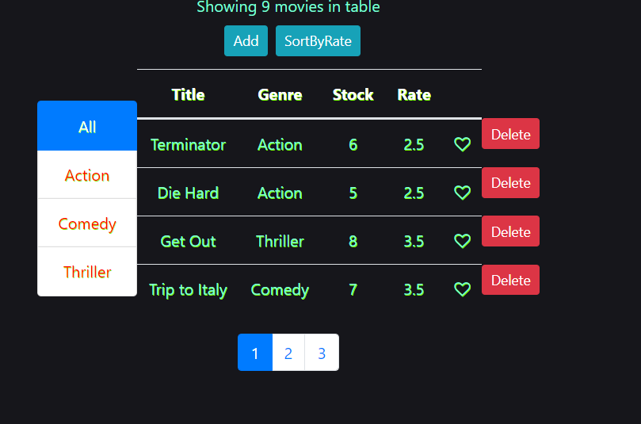

# VIDLY REACT PROJECT
This is Small React Project that fetches movies data and genres from backend and show in React frontend.

## Features
- Adding Movies
- Sort By Rate
- Like / Dislike Any Movie
- Pagination
- Delete Movies

## SKILL USED
- ML For Movies Recommendation ( Integration with project pending)
- React JS For Frontend
- NodeJs For Backend

## UI
1. UI IMAGE SHOWN FOR ALL MOVIES 

2. UI IMAGE SHOWN FOR SELECTED GENRE (ie comedy)

## STEPS TO RUN
1. Git Clone "URL OF THIS REPO"
2. npm install
3. npm start

## Future Scope

- Adding Genre Feature
- Adding Login For Every User
- Adding Realtime Movies Data with Movies Cast Detail, Budget and Boxoffice To show user latest movies release.
- Making More Interactive UI
- Providing Movies Recommendation System Based on User Liked Movies. (This Is Already Done But Integration with code is pending.)
- Creating SQLITE DB for storing detail and Deploying NodeJS API in HERUKU
